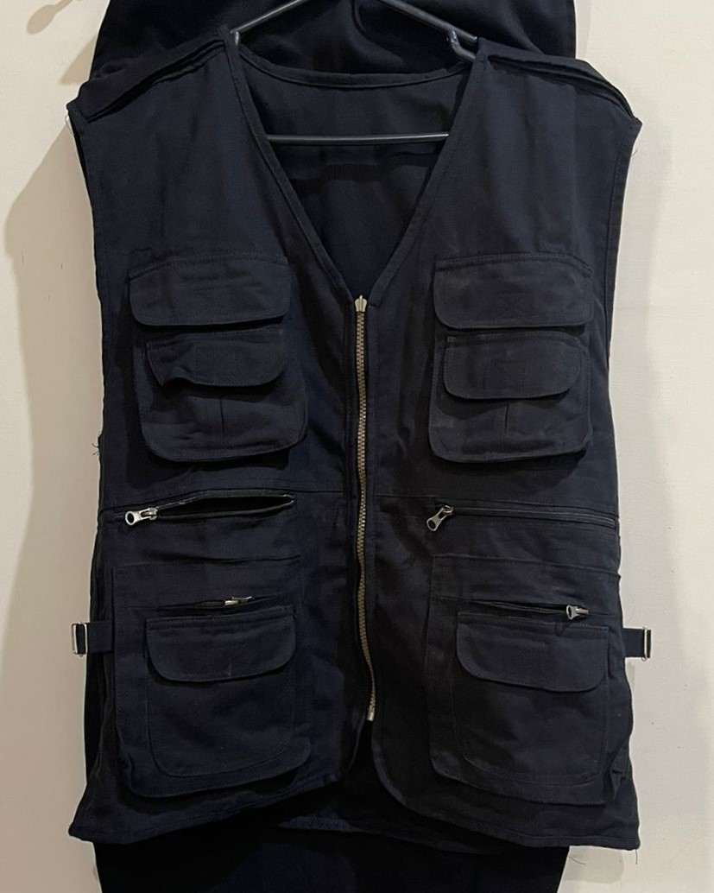
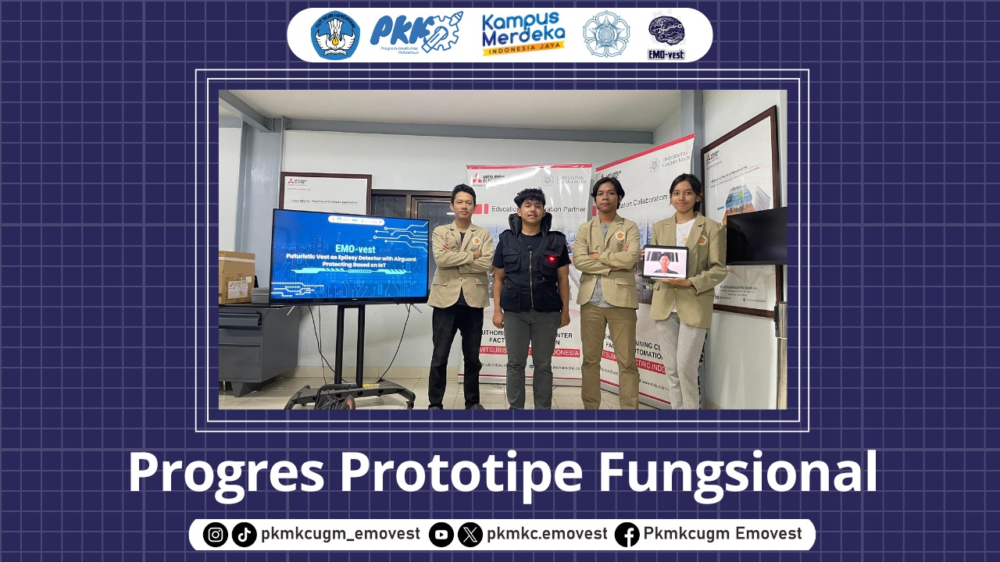

 

    

      <h4><b>Program Kreativitas Mahasiswa Karsa Cipta (PKM-KC) 2024 Skema Pendanaan - Diktiristek</b></h3>
    
      

  <h1> EMO-vest </h1>
  
 Futuristic Vest as Epilepsy Detector with Airguard Protecting Based on IoT 

 

EMO-vest mempermudah pertolongan darurat pada pasien epilepsi sekaligus memberikan perlindungan untuk mengurangi risiko cedera saat kambuh. Pengembangan EMO-vest juga mendorong pemanfaatan Internet of Things (IoT) untuk kemajuan ilmu pengetahuan dan teknologi di bidang kesehatan.

## Ikhtisar

Epilepsi adalah kondisi neurologis dengan gejala utama berupa kejang dan kehilangan kesadaran mendadak yang dapat mengancam jiwa jika tidak segera ditangani. Untuk mengatasi masalah ini, tim kami mengembangkan EMO-vest, sebuah alat monitoring dan pelindung berbasis _Internet of Things_ yang mendeteksi percepatan kemiringan dan getaran saat pasien epilepsi kambuh. Alat ini dilengkapi fitur pengiriman SMS dengan lokasi pasien, panggilan telepon, buzzer, LED, serta airbag otomatis untuk melindungi area vital pasien epilepsi sehingga pasien dapat beraktivitas dengan lebih aman dan mandiri.

## 🎥 &nbsp;Video Presentasi

## 👥 &nbsp;Kontributor
- Frengki Prabowo Saputro Wijayanto
- Artha Maressa Theodora Simanjuntak
- Muhammad Raihan Tsani
- Haydar Amru Revanda
- Gamma Nasim
- Ir. Noor Akhmad Setiawan, S.T., M.T., Ph.D., IPM.
